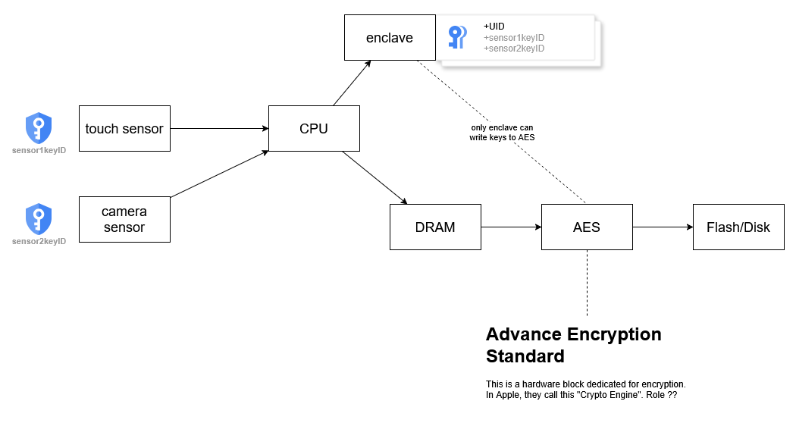
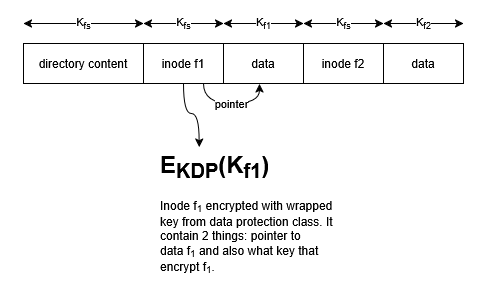

# Lecture 8: Client Device Security

## Two Categories of Client Devices

1. **Desktop/Laptop**  
   - Focus on **user-level isolation**, since a single machine can have multiple users.

2. **Mobile Phone/Smart Devices**  
   - User-level isolation is less relevant, as these devices are typically used by a **single user**.
   - Focus shifts to protecting **data on stolen devices**.

---

## Threat Model: Data Extraction from a Stolen Device

### Assumptions:
- The device is locked.
- The device is protected by a passcode or biometric mechanism.

---

## Security Strategy

Security is handled in **two stages**:

1. **Device-Level Security**
2. **Application-Level Security**

---

## Potential Attack Vectors

- Brute-force PIN guessing
- Physical removal of the flash chip
- Flashing a compromised operating system  
  (e.g., an OS without PIN enforcement)
- Spoofing biometric data (fake fingerprint or face)
- Exploiting vulnerabilities in the operating system

---

## Design Focus: Secure Enclave

### Key Features:
- **Dedicated CPU**, not a software sandbox or logical partition
- **UID (Unique Identifier)** embedded during manufacturing
- Only the **enclave can program AES keys**:
  - Main CPU can request AES operations but cannot write keys.
  - OS has access to RAM but **not AES or the enclave**.

- **Trusted sensor ID list**: Only known sensors can perform biometric authentication

### Primary Functions:
- **User Authentication**  
  - PIN, Touch ID, Face ID  
  - Retry limits

- **Key Management**  
  - Cryptographic operations isolated from the main CPU

### Biometric Authentication Flow:
- iOS detects biometric request → sends to Enclave
- Enclave generates **random nonce (challenge)**
- Sends nonce to biometric sensor
- Sensor performs scan and signs the challenge result
- Sends signed result back to enclave
- Enclave verifies result and sends only **true/false** to iOS

### Security Notes:
- Apple’s **vertical hardware-software integration** ensures that even if a biometric sensor is compromised, **only that device** is affected.
- This makes **hardware attacks costly and limited in scope**.

---

## Data Encryption

- Handled by a **dedicated AES encryption engine**
- **All disk I/O is encrypted**, ensuring **full-disk encryption**

### Key Management

- **EUID** (encrypted UID) is stored in AES, not in the enclave
- Enclave requests: “Encrypt this using your EUID”
- **Root Key (KPIN)**: derived through nested functions  
  KPIN = EUID ( EUID ( EUID ( PIN ))...)
  - Slow (~80ms)
  - Tied closely to device EUID

### Key Wrapping Strategy

- Introduce **wrap key**: `C = EKΔ(K2)`
- Example:
  - KPIN (from PIN) wraps KDP (data protection key)
  - KDP wraps file keys: Kf1, Kf2, etc.

#### File System Usage:
- KFS: file system-level key
- Directories and inodes encrypted with KFS
- Files encrypted with Kf1
- Inodes point to actual file data

### Data Protection Classes:

| Class                | Description                                                                 |
|----------------------|-----------------------------------------------------------------------------|
| **Complete**         | Key is deleted upon locking; data inaccessible until unlocked               |
| **Complete Unless Open** | Can append to file while locked (e.g., email attachments)              |
| **Until First Unlock** | Data accessible until next reboot (e.g., browser cache)                   |
| **No Protection**    | Accessible even before unlocking (e.g., music playback)                     |

### Secure Data Deletion:

- Deleting a key renders the associated encrypted data **irretrievable**
- Example:
  - EKUID(Kfs) removed → file system data is unreadable
  - EKDP(Kf1) removed → deletes file `f1`

---

## Secure Boot

1. **Boot ROM** starts and loads the low-level bootloader
2. Bootloader signature:  
   `δ = sign(devicePrivateKey, iBoot)`
3. Boot ROM verifies signature using **embedded Apple public key**
4. Upon success:
   - Bootloader loads and verifies **iOS kernel**
   - Then initializes **user space**

---

## Downgrade Attack Protection

- Bootloader signs:  
  `δ = sign(devicePrivateKey, ECID, iBoot)`  
  (where **ECID** is a unique, tamper-proof processor ID)

- iPhone contacts Apple for a signature for this ECID + iBoot combination
- Apple **only signs the latest iOS version** per ECID
- Prevents attackers from installing older, vulnerable versions

### Applies To:
- Over-the-air (OTA) updates
- Restores via iTunes or Finder

---

## 2024 vs 2020: Security Evolution

| Feature                        | 2020                          | 2024 Improvements                                                                 |
|-------------------------------|-------------------------------|------------------------------------------------------------------------------------|
| **Threat Model**              | Theft-focused                 | Includes **spoofed biometric mitigation**                                          |
| **Secure Enclave**            | Biometric auth, UID keys      | Adds **sensor-specific key provisioning**                                         |
| **Biometric Authentication**  | Basic matching                | Adds **freshness (nonce) and replay protection**                                  |
| **Rollback Protection**       | iOS version signing           | Apple signs **ECID + iBoot** to prevent downgrades                                |
| **Data Protection**           | Limited classes               | More **granular data protection classes** implemented                             |

